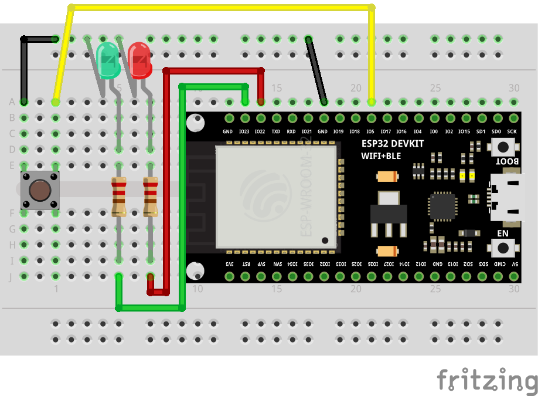

# JLed dynamic sequence demo

[](https://github.com/jandelgado/jled-example-switch-sequence/actions/workflows/build.yml)

This [JLed](https://github.com/jandelgado/jled) demo shows how to switch
between different `JLedSequence` objects using a push button.

Demo is set up for an ESP32 with LEDs connected to GPIO's 22, 23 and the 
bultin LED on GPIO 2. The button is connected to GPIO 5 and GND.



## Build

Using PlatformIO, just run

```
$ pio run -t upload
```

Or load the sketch into the Arduino IDE and build and upload there.

## Dependencies

Uses the `JC_Button` library.

## Author

(c) Copyright 2022 by Jan Delgado

